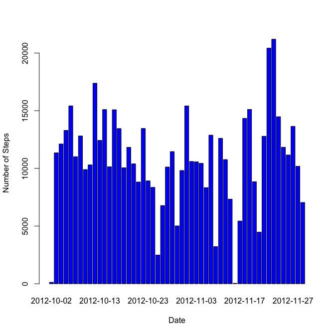
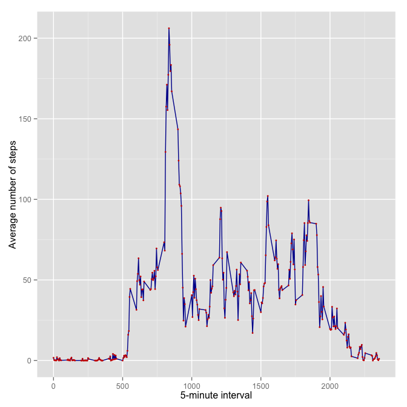
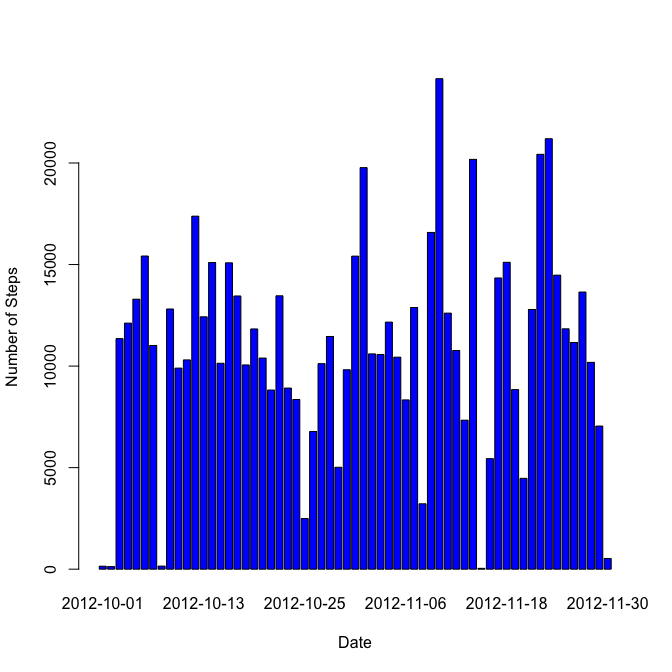
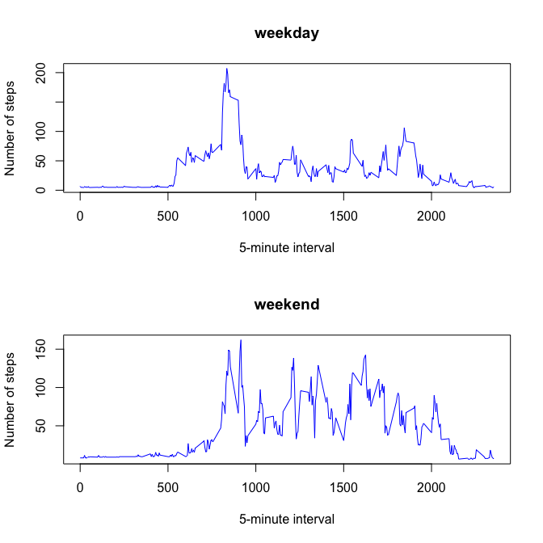

# Reproducible Research: Peer Assessment 1

This assignment makes use of data from a personal activity monitoring device. This device collects data at 5 minute intervals through out the day. The data consists of two months of data from an anonymous individual collected during the months of October and November, 2012 and include the number of steps taken in 5 minute intervals each day.

## Unzipping and loading the data


```r
data <- read.csv("activity.csv")
summary(data)
```

```
##      steps               date          interval   
##  Min.   :  0.0   2012-10-01:  288   Min.   :   0  
##  1st Qu.:  0.0   2012-10-02:  288   1st Qu.: 589  
##  Median :  0.0   2012-10-03:  288   Median :1178  
##  Mean   : 37.4   2012-10-04:  288   Mean   :1178  
##  3rd Qu.: 12.0   2012-10-05:  288   3rd Qu.:1766  
##  Max.   :806.0   2012-10-06:  288   Max.   :2355  
##  NA's   :2304    (Other)   :15840
```

The number of rows without NAs is  15264, and the number of rows are 17568.


## What is mean total number of steps taken per day?

### Make a histogram of the total number of steps taken each day.


```r
# Summarize the data by day
stepsByDate <- aggregate(steps ~ date, data=data, FUN=sum)
barplot(stepsByDate$steps, 
        names.arg=stepsByDate$date,
        xlab="Date", 
        ylab="Number of Steps", col="blue")
```

 


```r
# Calculate summary statistics
totalSteps <- tapply(data$steps, data$date, FUN=sum, na.rm=TRUE)
mean(totalSteps, na.rm=TRUE)
```

```
## [1] 9354
```

```r
median(totalSteps, na.rm=TRUE)
```

```
## [1] 10395
```

Based on this data, the mean for the total number of steps per day is 9354 and the median is 1.0395 &times; 10<sup>4</sup>.

## What is the average daily activity pattern?


```r
library(ggplot2)
averages <- aggregate(x=list(steps=data$steps), 
                      by=list(interval=data$interval),
                      FUN=mean, 
                      na.rm=TRUE)
ggplot(data=averages, 
       aes(x=interval, y=steps)) + 
       geom_line(colour="#000099") +  
       geom_point(size=1, colour="#CC0000") + 
       xlab("5-minute interval") +
      ylab("Average number of steps")
```

 


## Imputing missing values

### How many missing

In this data set, the total number of rows with NAs is 2304.


```r
sum(is.na(data))
```

```
## [1] 2304
```

###  Filling in all of the missing values in the dataset

The strategy chosen to fill the NAs data involves replacing each missing value with the mean value of its 5-minute interval.


```r
# Replace each missing value with the mean value of its 5-minute interval

stepsByInterval <- aggregate(steps ~ interval, data=data, FUN=mean)
dataFilled <- merge(data, stepsByInterval, by="interval")
data$steps[ is.na(data$steps)] <- dataFilled$steps.y[ is.na(data$steps)]
```

### Make a histogram of the total number of steps taken each day 

Now, using the new filled data set, let's make a histogram of the total number of steps taken each day and calculate the mean and median total number of steps.


```r
stepsByDate <- aggregate(steps ~ date, data=data, FUN=sum)
barplot(stepsByDate$steps, 
        names.arg=stepsByDate$date, 
        xlab="Date", 
        ylab="Number of Steps", col="blue")
```

 

### Calculate the mean and median total number of steps taken per day


```r
totalSteps <- tapply(data$steps, data$date, FUN=sum)
mean(totalSteps)
```

```
## [1] 10890
```

```r
median(totalSteps)
```

```
## [1] 11015
```

Based on this filled data, the mean for the total number of steps per day is 1.089 &times; 10<sup>4</sup> and the median is 1.1015 &times; 10<sup>4</sup>. This is slightly higher than when the data contain NAs.


## Are there differences in activity patterns between weekdays and weekends?


```r
daytype <- function(date) {  
    wday <- as.POSIXlt(date)$wday 
    if (wday %in% c(6, 0)) return("weekend")
    else if (wday %in% c(1, 2, 3, 4, 5)) return("weekday")
    else stop("invalid date")
}
data$date <- as.Date(data$date)
data$daytype <- factor(sapply(data$date, FUN=daytype))
```


```r
par(mfrow=c(2,1))
for (type in c("weekday", "weekend")) {
    stepsByType <- aggregate(steps ~ interval,
                            data=data,
                            subset=data$daytype==type,
                            FUN=mean)
    plot(stepsByType, 
         type="l", 
         main=type ,
         xlab("5-minute interval") ,  
         ylab("Number of steps") , col="blue")
}
```

 

In the light of these plots, there are a larger number of intervals with a number of steps is greater (higher activity) over the weekend. Therefore, we can infer that the activity is higher during weekends than during weekdays.

