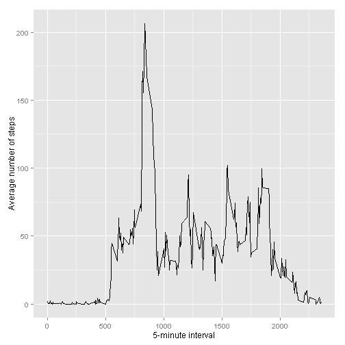

Reproducible Research: Peer Assessment 1
========================================================

This assignment makes use of data from a personal activity monitoring device. This device collects data at 5 minute intervals through out the day. The data consists of two months of data from an anonymous individual collected during the months of October and November, 2012 and include the number of steps taken in 5 minute intervals each day.

## Unzipping and loading the data


```r
data <- read.csv("activity.csv")
```


## What is mean total number of steps taken per day?

### Make a histogram of the total number of steps taken each day.


```r
steps.date <- aggregate(steps ~ date, data=data, FUN=sum)
barplot(steps.date$steps, names.arg=steps.date$date, xlab="Date", ylab="Steps")
```

 


```r
total.steps <- tapply(data$steps, data$date, FUN=sum, na.rm=TRUE)
mean(total.steps, na.rm=TRUE)
```

```
## [1] 9354
```

```r
median(total.steps, na.rm=TRUE)
```

```
## [1] 10395
```


## What is the average daily activity pattern?


```r
library(ggplot2)
averages <- aggregate(x=list(steps=data$steps), by=list(interval=data$interval),
                      FUN=mean, na.rm=TRUE)
ggplot(data=averages, aes(x=interval, y=steps)) +
    geom_line() +
    xlab("5-minute interval") +
    ylab("Average number of steps")
```

 


## Imputing missing values

### How many missing

```r
sum(is.na(data))
```

```
## [1] 2304
```

###  Filling in all of the missing values in the dataset


```r
# Replace each missing value with the mean value of its 5-minute interval

steps.interval <- aggregate(steps ~ interval, data=data, FUN=mean)
data.filled <- merge(data, steps.interval, by="interval")
data$steps[ is.na(data$steps)] <- data.filled$steps.y[ is.na(data$steps)]
```


### Make a histogram of the total number of steps taken each day 

Now, using the filled data set, let's make a histogram of the total number of steps taken each day and calculate the mean and median total number of steps.


```r
steps.date <- aggregate(steps ~ date, data=data, FUN=sum)
barplot(steps.date$steps, names.arg=steps.date$date, xlab="date", ylab="steps")
```

 

### Calculate and report the mean and median total number of steps taken per day


```r
total.steps <- tapply(data$steps, data$date, FUN=sum)
mean(total.steps)
```

```
## [1] 10890
```

```r
median(total.steps)
```

```
## [1] 11015
```


## Are there differences in activity patterns between weekdays and weekends?


```r
daytype <- function(date) {  
    wday <- as.POSIXlt(date)$wday 
    if (wday %in% c(6, 0)) return("weekend")
    else if (wday %in% c(1, 2, 3, 4, 5)) return("weekday")
    else stop("invalid date")
}
data$date <- as.Date(data$date)
data$daytype <- factor(sapply(data$date, FUN=daytype))
```


```r
par(mfrow=c(2,1))
for (type in c("weekday", "weekend")) {
    steps.type <- aggregate(steps ~ interval,
                            data=data,
                            subset=data$daytype==type,
                            FUN=mean)
    plot(steps.type, type="l", main=type ,
         xlab("5-minute interval") ,  ylab("Number of steps"))
}
```

 

```r
averages <- aggregate(steps ~ interval + daytype, data=data, mean)
ggplot(averages, aes(interval, steps)) + geom_line() + facet_grid(day ~ .) +
    xlab("5-minute interval") + ylab("Number of steps")
```

```
## Error: At least one layer must contain all variables used for facetting
```

